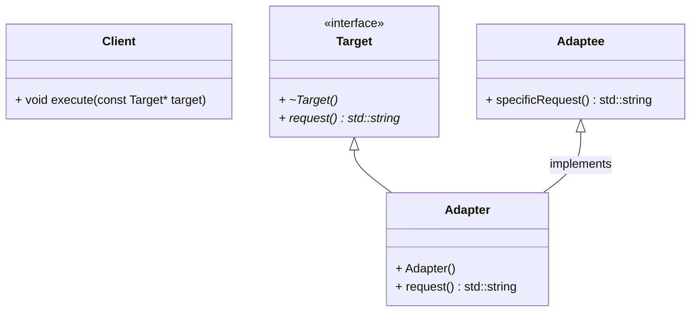
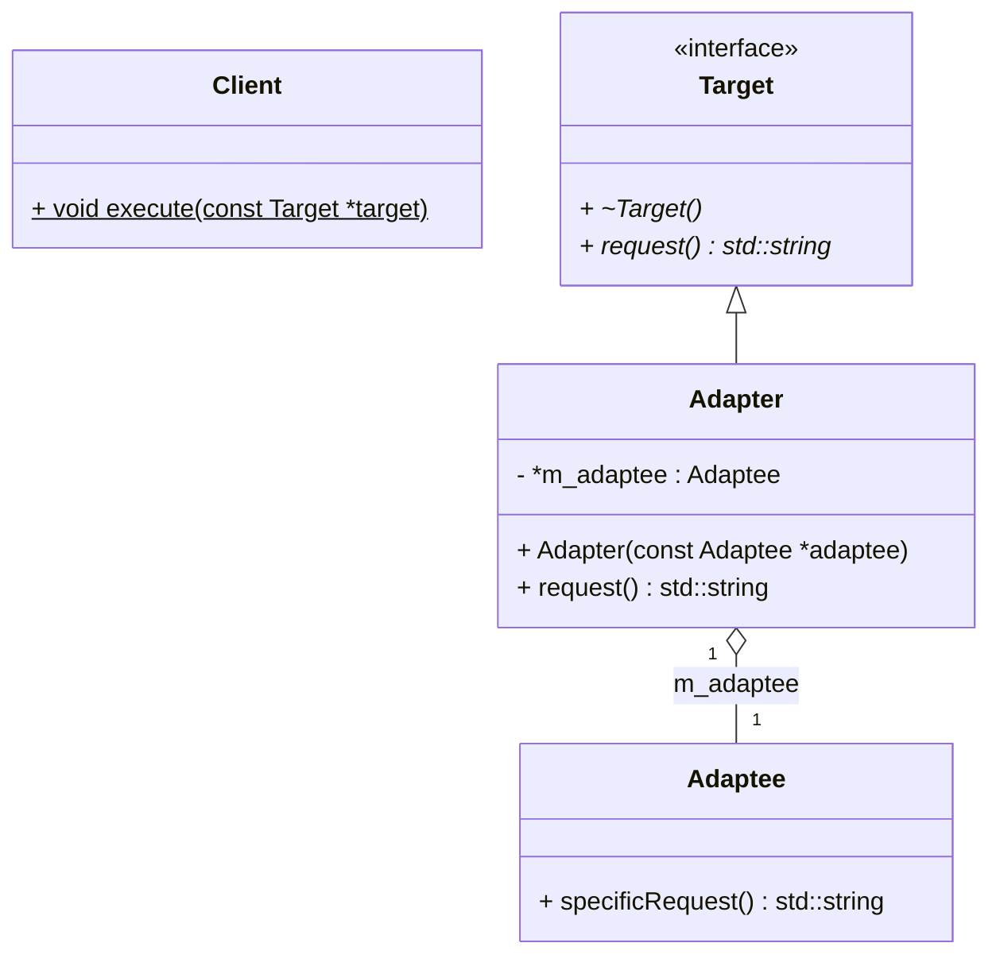

# Adapter (适配器) --- 类对象结构型模式

---

Adapter is a structural design pattern that allows objects with incompatible interfaces to collaborate.

## 1. 意图

将一个类的接口转换成客户希望的另外一个接口。

Adapter模式使得原本由于接口不兼容而不能在一起工作的那些类可以一起工作。

## 2. 别名

包装器 (Wrapper)

## 3. 动机

有时，为复用而设计的工具箱类不能够被复用，仅仅是因为它的接口与专业应用领域所需要的接口不匹配 。

## 4. 适用性

以下情况适用Adapter模式

- 你想使用一个已经存在的类，而它的接口不符合你的需求

- 你想创建一个可以复用的类，该类可以与其他不相关的类或不可预见的类协同工作

- 你想使用一些已经存在的子类，但是不可能对每一个都进行子类化以匹配它们的接口。 对象适配器可以适配它的父类接口。

## 5. 结构

### 5.1 类适配器

类适配器使用多重继承对一个接口与另一个接口进行匹配。 如下图所示：

### 5.2 对象适配器

对象适配器依赖于对象组合。如下图所示：

## 6. 参与者

- **Target** 

    定义**Client**使用的与特定领域相关的接口　

- **Client**

    与符合**Target**接口的对象协同

- **Adaptee (适配者)**

    定义一个已经存在的接口，这个接口需要适配

- **Adapter (适配器)**

    对**Adaptee**的接口与**Target**接口进行适配