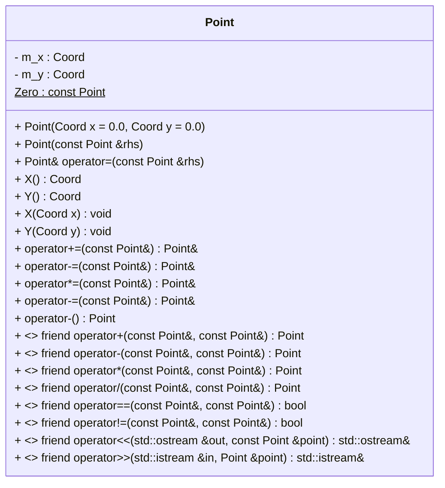
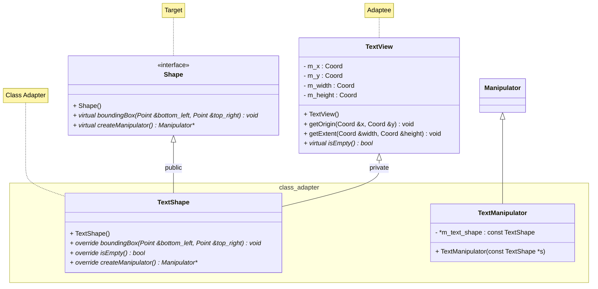
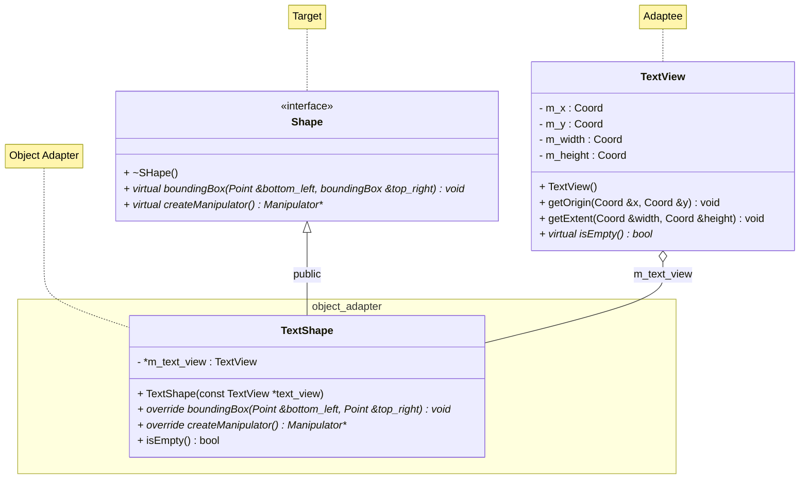

# Adapter适配器模式的结构图

## 　类适配器

```mermaid
classDiagram
    class Point {
        + Point(Coord x = 0.0, Coord y = 0.0)
        + Point(const Point &rhs)
        + Point& operator=(const Point &rhs)

        - m_x : Coord
        - m_y : Coord

        Zero : const Point$

        + X() Coord
        + Y() Coord
        + X(Coord x) void
        + Y(Coord y) void

        + operator+=(const Point&) Point&
        + operator-=(const Point&) Point&
        + operator*=(const Point&) Point&
        + operator-=(const Point&) Point&

        + operator-() Point

        + <<friend>> friend operator+(const Point&, const Point&) Point
        + <<friend>> friend operator-(const Point&, const Point&) Point
        + <<friend>> friend operator*(const Point&, const Point&) Point
        + <<friend>> friend operator/(const Point&, const Point&) Point

        + <<friend>> friend operator==(const Point&, const Point&) bool
        + <<friend>> friend operator!=(const Point&, const Point&) bool

        + <<friend>> friend operator<<(std::ostream &out, const Point &point) std::ostream&
        + <<friend>> friend operator>>(std::istream &in, Point &point) std::istream&
    }
```

---

```mermaid
classDiagram
    

    class Manipulator {
    }

    class Shape {
        <<interface>>
        + Shape()

        + virtual boundingBox(Point &bottom_left, Point &top_right) void*
        + virtual createManipulator() Manipulator**
    }
    note for Shape "Target"
    

    class TextView {
        - m_x : Coord
        - m_y : Coord
        - m_width : Coord
        - m_height : Coord

        + TextView()

        + getOrigin(Coord &x, Coord &y) void
        + getExtent(Coord &width, Coord &height) void
        + virtual isEmpty() bool*
    }
    note for TextView "Adaptee"

    namespace class_adapter {
        class TextShape {
            + TextShape()

            + override boundingBox(Point &bottom_left, Point &top_right) void*
            + override isEmpty() bool*
            + override createManipulator() Manipulator**
        }
        

        class TextManipulator {
            + TextManipulator(const TextShape *s)

            - *m_text_shape : const TextShape
        }
    }
    note for TextShape "Class Adapter"

    Manipulator <|-- TextManipulator

    Shape <|-- TextShape : public
    TextView <|-- TextShape : private
```

## 对象适配器

```mermaid
classDiagram
    
    class Shape {
        <<interface>>

        + ~SHape()
        + virtual boundingBox(Point &bottom_left, boundingBox &top_right) void*
        + virtual createManipulator() Manipulator**
    }

    note for Shape "Target"

    class TextView {
        - m_x : Coord
        - m_y : Coord
        - m_width : Coord
        - m_height : Coord

        + TextView()

        + getOrigin(Coord &x, Coord &y) void
        + getExtent(Coord &width, Coord &height) void
        + virtual isEmpty() bool*
    }

    note for TextView "Adaptee"

    namespace object_adapter {
        class TextShape {
            - *m_text_view : TextView

            + TextShape(const TextView *text_view)

            + override boundingBox(Point &bottom_left, Point &top_right) void*
            + override createManipulator() Manipulator**

            + isEmpty() bool
        }
    }

    note for TextShape "Object Adapter"

    Shape <|-- TextShape : public
    TextView o-- TextShape : m_text_view
```