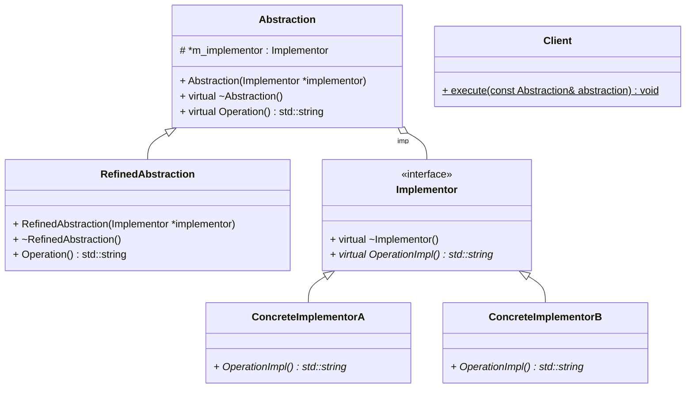

# Bridge (桥接) --- 对象结构型模式

## 意图

将抽象部分与它的实现部分分离开来，使它们可以独立地变化。

## 动机

当一个抽象可能有多个实现时，通常用继承来协调它们。

抽象类定义对该抽象的接口，而具体的子类则用不同方式加以实现，但此方法有时不够灵活。

继承机制将抽象部分与它的实现部分固定在一起，使得难以对抽象部分与实现部分独立地进行修改、扩充和复用。

## 适用性

以下情况可以使用Bridge模式：

1. 你不希望在抽象和它的实现部分之间有一个固定的绑定关系。

2. 类的抽象以及它的实现都应该可以通过生成子类的方法加以扩充。

    这时Bridge模式使你可以对不同的抽象接口和实现部分进行组合，并分别对它们进行扩充。

3. 对一个抽象的实现部分的修改应对客户不产生影响，即客户的代码不必重新编译。

4. 你想对客户完全隐藏抽象的实现部分。

## 结构

## 参与者

- **Abstraction** 
    - 定义抽象类的接口
    - 维护一个指向 Implementor 类型对象的指针

- **RefinedAbstraction**
    - 扩充由 Abstraction 定义的接口

- **Implementor**
    - 定义实现类的接口，该接口不一定要与 Abstraction 的接口完全一直。

        事实上这两个接口可以完全不同。 一般来说，Implementor 接口仅提供基本操作，而 Abstraction 则定义了基于这些基本操作的较高层次的操作。

- **ConcreteImplementor**
    - 实现 Implementor 接口并定义它的具体实现。

## 协作

- Abstraction 将 Client 的请求转发给他的 Implementor 对象

## 效果

Bridge 模式有以下一些优点：

1. **分离接口及其实现部分** 一些实现未必不变地绑定在一些接口上。抽象类的实现可以在运行时进行配置，一个对象甚至可以在运行时改变它的实现。

    将 Abstraction 与 Implementor 分离有助于降低对实现部分编译时的依赖性，当改变一个实现类时，并不需要重新编译 Abstraction 类和它的 Client 程序。

    为了保证一个类库的不同版本之间的二进制兼容性，一定要有这个性质。

    另外，接口和实现分离有助于分层，从而产生更好的结构化系统，系统的高层部分仅需知道 Abstraction 和 Implementor.

2. **提高可扩充性** 你可以独立地对 Abstraction 和 Implementor 层次结构进行扩充。

3. **实现细节对客户透明** 你可以对客户隐藏实现细节，例如共享 Implementor 对象以及相应的引用计数机制。

## 实现

使用Bridge模式时需要注意以下一些问题：

### 仅有一个 `Implementor`

在仅有一个实现的时候，没有必要创建一个抽象的 `Implementor` 类. 这是Bridge模式的退化情形， 在 `Abstraction` 与 `Implementor` 之间有种一对一的关系。

尽管如此，当你希望改变一个类的实现不影响已有的客户程序时，模式的分离机制还是非常有用的，也就是说，不必重新编译他们，仅需重新链结。

在C++中，`Implementor` 类的类接口可以在一个私有的头文件中定义，这个文件不提供给客户。这样你就对客户彻底隐藏了一个类的实现部分。

### 创建正确的 `Implementor` 对象

当存在多个 `Implementor` 类的时候，你应该用何种方法，何时在何处确定创建一个 `Implementor` 类呢？

如果 `Abstraction` 知道所有的 `ConcreteImplementor` 类，它就可以在它的构造器中对其中个一个类进行实例化，它可以通过传递给构造器的参数确定实例化哪一个类。

另一种方法是首先选择一个缺省的实现，然后根据需要改变这个实现。

也可以代理给另一个对象，由它一次决定。 在 `Window/WindowImpl` 的例子中，我们可以引入一个 factory 对象，该对象的唯一职责就是封装系统平台的细节。这个对象知道

应该为所用的平台创建何种类型的 `WindowImpl` 对象，`Window` 仅需向它请求一个 `WindowImpl`，而它会返回正确类型的 `WindowImpl` 对象。

这种方法的优点是 `Abstraction` 类不和任何一个 `Implementor` 类直接耦合。

### 共享 `Implementor` 对象

### 采用多重继承机制

在C++中可以使用多重继承机制将抽象接口和它的实现部分结合起来。 例如，一个类可以用`public`方式继承 `Abstraction`，而以`private`方式继承 `ConcreteImplementor`.

但是由于这种方法依赖于静态继承，它将实现部分与接口固定不变地绑定在一起。 因此不可能使用多重继承的方法实现真正的Bridge模式---至少用C++不行。

## 代码实现