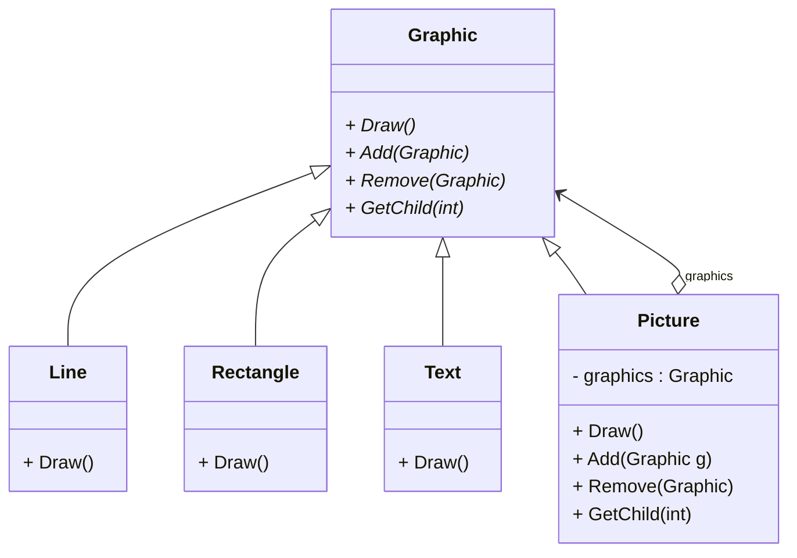
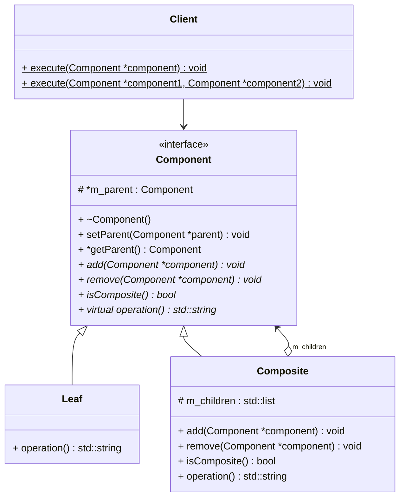

# Composite (组合) --- 对象结构型模式

## 意图

将对象组合成树形结构以表示 “部分---整体” 的层次结构。

Composite 使得用户对单个对象和组合对象的使用具有一致性。

## 动机

Composite模式描述了如何使用递归组合，使得用户不必对图元对象和容器对象进行类别区分。 如下图所示：

Composite模式的关键是一个抽象类，它既可以代表图元，又可以代表图元的容器。

## 适用性

以下情况下使用Composite模式：

- 你想表示对象的“部分---整体”层次结构

- 你希望用户忽略组合对象和单个对象的不同，用户将统一地使用组合结构中的所有对象

## 结构

