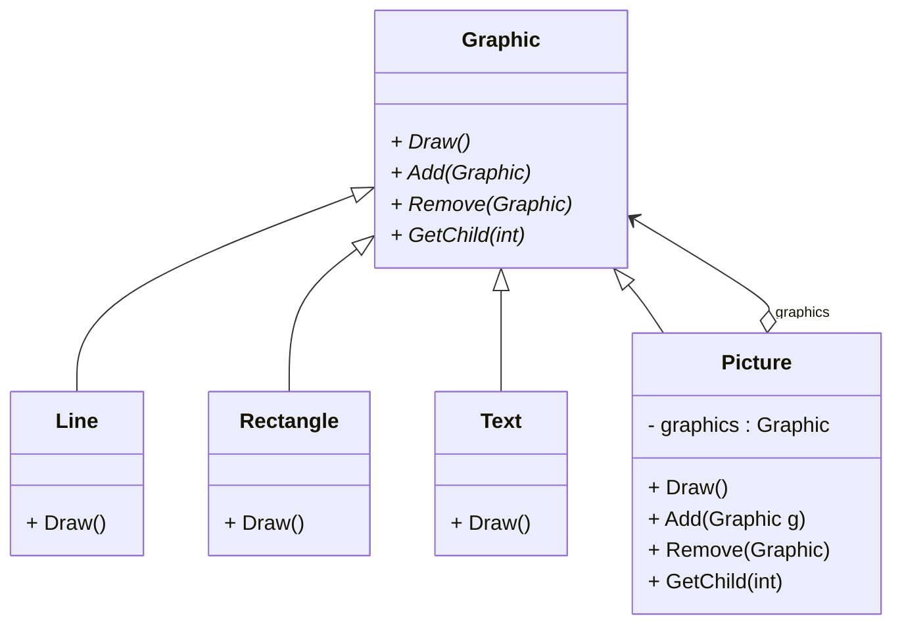
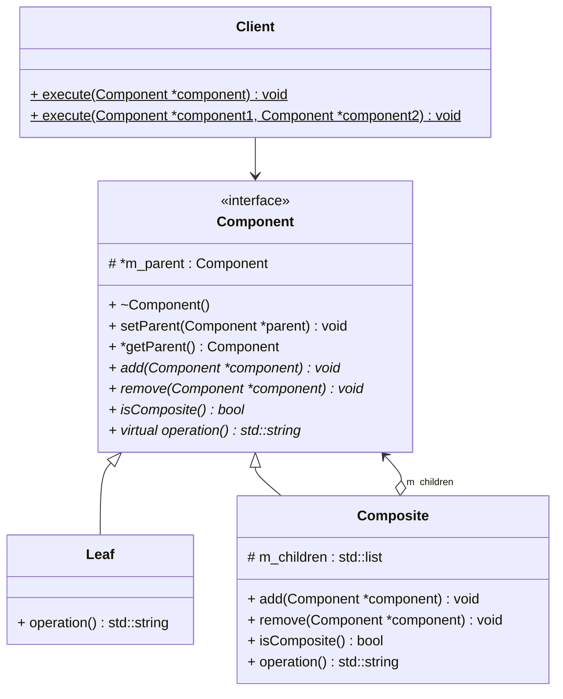
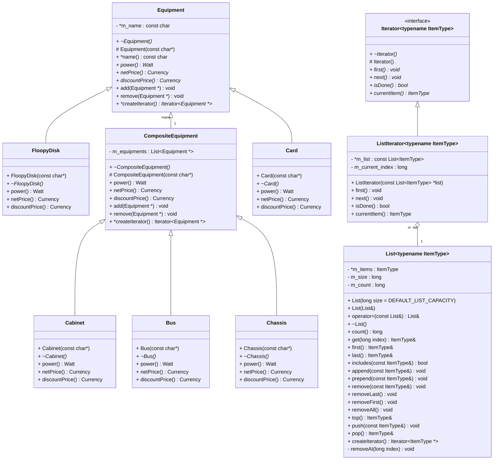

# Composite (组合) --- 对象结构型模式

## 意图

将对象组合成树形结构以表示 “部分---整体” 的层次结构。

Composite 使得用户对单个对象和组合对象的使用具有一致性。

## 动机

Composite模式描述了如何使用递归组合，使得用户不必对图元对象和容器对象进行类别区分。 如下图所示：

```mermaid
classDiagram
    class Graphic {
        + Draw()*
        + Add(Graphic)*
        + Remove(Graphic)*
        + GetChild(int)*
    }

    class Line {
        + Draw()
    }

    class Rectangle {
        + Draw()
    }

    class Text {
        + Draw()
    }

    class Picture {
        - graphics : Graphic

        + Draw()
        + Add(Graphic g)
        + Remove(Graphic)
        + GetChild(int)
    }

    Graphic <|-- Line
    Graphic <|-- Rectangle
    Graphic <|-- Text
    Graphic <|-- Picture
    Graphic <--o "graphics" Picture
```

Composite模式的关键是一个抽象类，它既可以代表图元，又可以代表图元的容器。

## 适用性

以下情况下使用Composite模式：

- 你想表示对象的“部分---整体”层次结构

- 你希望用户忽略组合对象和单个对象的不同，用户将统一地使用组合结构中的所有对象

## 结构

```mermaid
classDiagram
    class Client {
        + execute(Component *component) void$
        + execute(Component *component1, Component *component2) void$
    }

    class Component {
        <<interface>>
        # *m_parent : Component

        + ~Component()
        + setParent(Component *parent) void
        + *getParent() Component

        + add(Component *component) void*
        + remove(Component *component) void*
        + isComposite() bool*

        + virtual operation() std::string*
    }

    Client --> Component

    class Leaf {
        + operation() std::string
    }

    class Composite {
        # m_children : std::list<Component *>

        + add(Component *component) void
        + remove(Component *component) void
        + isComposite() bool

        + operation() std::string
    }

    Component <|-- Leaf
    Component <|-- Composite
    Component <--o "m_children" Composite
```

## 参与者

- Component
    - 为组合中的对象声明接口
    - 在适当的情况下，实现所有类共有接口的缺省行为
    - 声明一个接口用于访问和管理Component的子组件
    - 在递归结构中定义一个接口，用于访问一个父部件，并在合适的情况下试下它。

- Leaf
    - 在组合中表示叶子节点对象，叶子节点没有子节点。
    - 在组合中定义图元对象的行为

- Composite
    - 定义有子部件的那些部件的行为
    - 存储子部件
    - 在 Component 接口中实现与子部件有关的操作

- Client
    - 通过 Component 接口操纵组合部件的对象

## 协作

用户使用Component类接口与组合结构中的对象进行交互。

如果接收者是一个叶子节点，则直接处理请求。 如果接收者是Composite，它通常将请求转发给它的子部件。

## 效果

- **定义了包含基本对象和组合对象的类层次结构**

    基本对象可以被组合成更复杂的组合对象，而这个组合对象又可以被组合，这样不断地递归下去。在客户代码中，

    任何用到基本对象的地方都可以使用组合对象。

- **简化客户代码**

    客户可以一致地使用组合结构和单个对象。 通常客户不需要知道处理的是一个叶子节点还是一个组合节点。

    这就简化了客户代码，因为在定义组合的那些类中不需要写一些充斥着选择语句的函数。

- **使得更容易添加新类型的组件**

    新定义的Composite或Leaf子类自动地与已有的结构和客户代码一起工作，客户程序不需要
    因新的Component类而改变。

- **使你的设计变得更加一般化**

## 实现

在实现Composite模式时需要考虑以下几个问题：

显式的父部件引用

保持从子部件到父部件的引用能简化组合结构的遍历和管理。通常在Component类中定义父部件引用（或指针），

而在Leaf和Composite类可以继承这个引用以及管理这个引用。

最大化Component接口

Composite模式的目的之一就是使得用户不知道他们正在使用的具体的Leaf和Composite类。

为了达到这个目的，Composite类应为Leaf类和Composite类尽可能提供一些公共操作。 Composite类自身为这些

公共操作提供缺省的实现，而Leaf类和Composite的子类可以对他们进行重写。

声明管理子部件的操作

## 代码实例

```mermaid
classDiagram
    class Equipment {
        - *m_name : const char
        + ~Equipment()*

        # Equipment(const char*)
        + *name() const char
        + power() Watt*
        + netPrice() Currency*
        + discountPrice() Currency*

        + add(Equipment *) void
        + remove(Equipment *) void
        + *createIterator() Iterator~Equipment *~*
    }

    class FloopyDisk {
        + FloopyDisk(const char*)
        + ~FloopyDisk()*

        + power() Watt
        + netPrice() Currency
        + discountPrice() Currency
    }

    Equipment <|-- FloopyDisk

    class CompositeEquipment {
        + ~CompositeEquipment()*
        # CompositeEquipment(const char*)

        + power() Watt
        + netPrice() Currency
        + discountPrice() Currency

        + add(Equipment *) void
        + remove(Equipment *) void
        + *createIterator() Iterator~Equipment *~

        - m_equipments : List~Equipment *~
    }

    Equipment "many" <|-- "1" CompositeEquipment

    class Iterator~typename ItemType~ {
        <<interface>>
        + ~Iterator()*
        # Iterator()

        + first() void*
        + next() void*
        + isDone() bool*
        + currentItem() ItemType*
    }

    class List~typename ItemType~ {
        + List(long size = DEFAULT_LIST_CAPACITY)
        + List(List&)
        + operator=(const List&) List&
        + ~List()

        + count() long
        + get(long index) ItemType&
        + first() ItemType&
        + last() ItemType&
        + includes(const ItemType&) bool

        + append(const ItemType&) void
        + prepend(const ItemType&) void
        + remove(const ItemType&) void
        + removeLast() void
        + removeFirst() void
        + removeAll() void

        + top() ItemType&
        + push(const ItemType&) void
        + pop() ItemType&

        + createIterator() Iterator~ItemType *~

        - removeAt(long index) void

        - *m_items : ItemType
        - m_size : long
        - m_count : long
    }

    class ListIterator~typename ItemType~ {
        + ListIterator(const List~ItemType~ *list)

        + first() void
        + next() void
        + isDone() bool
        + currentItem() ItemType

        - *m_list : const List~ItemType~
        - m_current_index : long
    }

    Iterator~ItemType~ <|-- ListIterator~ItemType~
    ListIterator~ItemType~ "m_list" o-- "1" List~ItemType~

    class Cabinet {
        + Cabinet(const char*)
        + ~Cabinet()*

        + power() Watt
        + netPrice() Currency
        + discountPrice() Currency
    }

    CompositeEquipment <|-- Cabinet

    class Bus {
        + Bus(const char*)
        + ~Bus()*

        + power()  Watt
        + netPrice() Currency
        + discountPrice() Currency
    }

    CompositeEquipment <|-- Bus

    class Card {
        + Card(const char*)
        + ~Card()*

        + power() Watt
        + netPrice() Currency
        + discountPrice() Currency
    }

    Equipment <|-- Card

    class Chassis {
        + Chassis(const char*)
        + ~Chassis()*

        + power() Watt
        + netPrice() Currency
        + discountPrice() Currency
    }

    CompositeEquipment <|-- Chassis
```