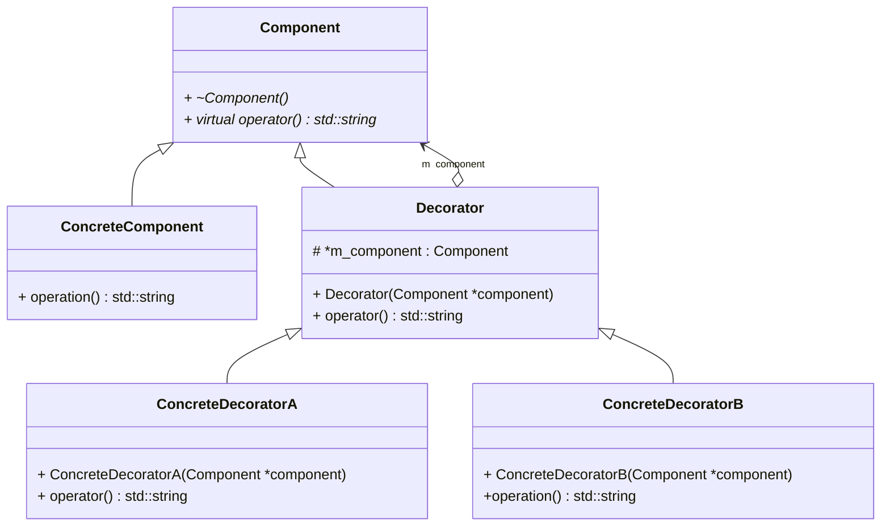

# Decorator (装饰器) --- 对象结构型模式

## 意图

动态地给一个对象添加一些额外的职责。就增加功能来说，Decorator模式比生成子类更为灵活。

## 别名

包装器（Wrapper）

## 动机

## 适用性

以下情况下使用Decorator模式：

- 在不影响其他对象的情况下，以动态、透明的方式给单个对象添加职责

- 处理那些可以撤销的职责

- 当不能采用生成子类的方法进行扩充时。

    一种情况是，可能有大量独立的扩展，为支持每一种组合将产生大量的子类，使得子类数目呈爆炸性增长。
    
    另一种情况可能是，类定义被隐藏，或者类定义不能用于生成子类。

## 结构

## 参与者

- Component (`VisualComponent`)

    定义一个对象接口，可以给这些对象动态地添加职责

- ConcreteComponent (`TextView`)

    定义一个对象，可以给这个对象添加一些职责

- Decorator

    维持一个指向Component对象的指针，并定义一个与Component接口一致的接口

- ConcreteDecorator (`BorderDecorator`, `ScrollDecorator`)

    向组件添加职责
    
## 协作

- Decorator 将请求转发给它的`component`对象，并有可能在转发请求前后执行一些附加的动作。

## 效果

Decorator模式至少有两个主要优点和两个缺点

### 比静态继承更灵活

    与对象的静态继承（多重继承）相比，Decorator模式提供了更加灵活地向对象添加职责的方式。
    
    可以用添加和分离的方法，用装饰在运行时增加和删除职责。 相比之下，继承机制要求为每一个添加的职责创建一个新的子类，
    
    这会产生许多新的类，并且会增加系统的复杂度。

    此外，为一个特定的`component`类提供多个不同的`Decorator`类，这就使得你可以对一些职责进行混合和匹配。
    
### 避免在层次结构高层的类有太多的特征

    Decorator模式提供了一种“即用即付”的方法来添加职责。

    它并不试图在一个复杂的可定制的类中支持所有可预见的特征，相反，你可以定义一个简单的类，并且用Decorator类给它逐渐地
    
    添加功能。可以从简单的部件组合出复杂的功能，这样，应用程序不必为不需要的特征付出代价。
    
### Decorator与它的Component不一样

    Decorator是一个透明的包装。
    
    如果我们从对象标识的观点出发，一个被装饰了的组件与该组件本身是有差别的，因此，使用装饰时不应该依赖对象标识。
    
### 有很多小对象

    采用Decorator模式进行系统设计往往会产生很多看上去类似的小对象，这些对象仅仅在它们相互连接的方式上有所不同，
    
    而不是它们的类或是它们的属性有所不同。
    

## 实现

使用Decorator模式时应注意一下几点；

- 接口一致性

装饰对象的接口必须与它所装饰的Component的接口是一致的。 因此，所有的`ConcreteDecorator`类必须有一个公共的父类。

- 省略抽象的Decorator类

当你仅需要添加一个职责时，没有必要定义抽象的Decorator类。 你常常需要处理现存的类层次结构而不是设计一个新系统，这时你

可以把Decorator向Component转发请求的职责合并到ConcreteDecorator中。

- 保持Component类的简单性

为了保证接口的一致性，组件和装饰必须有一个公共的Component父类。因此保持这个类的简单性非常重要，即它应集中于定义接口

而不是存储数据。 对数据表示的定义应该延迟到子类中，否则Component类会变得过于复杂和庞大，因而难以大量使用。

赋予Component太多的功能也使得具体的子类有一些它们并不需要的功能的可能性大大增加。

- 改变对象外壳与改变对象内核

我们可以将Decorator看作一个对象的外壳，它可以改变这个对象的行为。另外一种方法是改变对象的内核。
