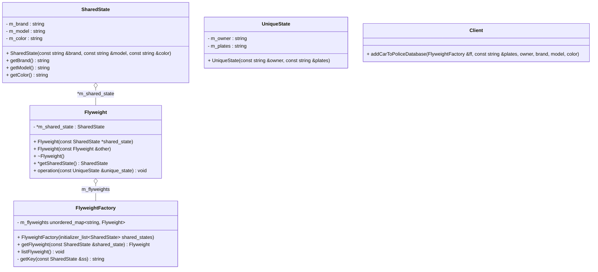

# Flyweight Pattern 享元模式

## 意图

运用共享技术有效地支持大量细粒度的对象

## 动机

Flyweight模式描述了如何共享对象，使得可以细粒度地使用它们而不需要高昂的代价。

Flyweight是一个共享对象，它可以同时在多个场景context中使用，并且在每个场景中Flyweight都可以作为一个独立的对象。

Flyweight模式对那些通常由于数量太大而难以用对象来表示的概念或实体进行建模。

## 适用性

Flyweight模式的有效性很大程度上取决于如何使用它，以及在何处使用它。 当以下情况都成立时使用Flyweight模式：

- 一个应用程序使用了大量的对象
- 完全由于使用大量的对象造成了很大的存储开销
- 对象的大多数状态可变为外部状态
- 如果删除对象的外部状态，那么可以用相对较少的共享对象取代很多组对象
- 应用程序不依赖于对象标识

## 结构

## 参与者

- Flyweight 

> 描述一个接口，通过这个接口flyweight可以接受并作用于外部状态

- SharedState

> 实现Flyweight接口，并为内部状态增加存储空间。SharedState对象必须是共享的。它所存储的状态必须是内部的，
> 
> 即它必须独立于Flyweight对象的场景。

- UniqueState 

> 并非所有的Flyweight子类都需要被共享。 Flyweight接口使共享成为可能。但它并不强制共享。
>
> 在Flyweight对象接口的某些层次，UniqueState对象通常将SharedState对象作为子节点。

- FlyweightFactory

> 创建并管理Flyweight对象

> 确保合理地共享Flyweight. 当用户请求一个Flyweight时，FlyweightFactory对象提供一个已经创建的实例或创建一个（如果不存在的话）

- Client

> 维持一个对flyweight的引用
>
> 计算或存储一个（或多个）flyweight的外部状态

